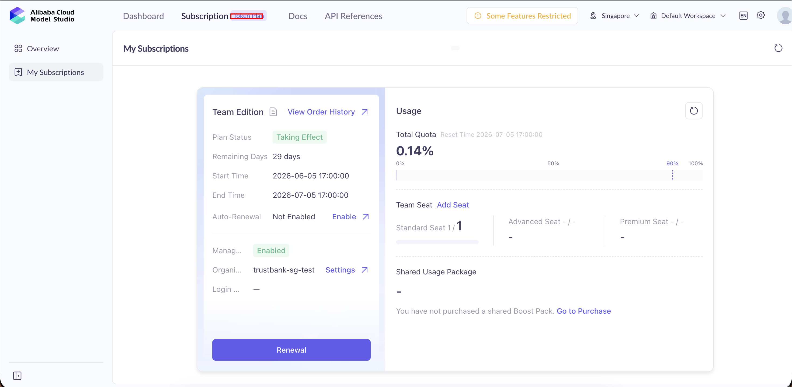
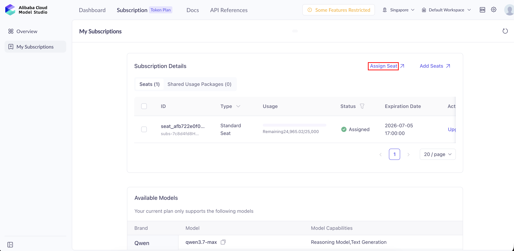
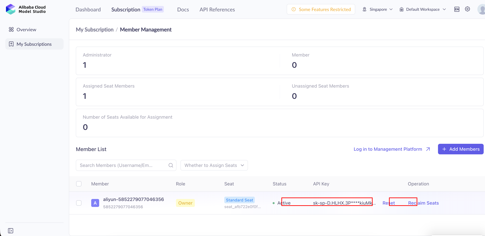

# How to Generate Coding Plan API Key

## Step 1: Go to Token Plan Dashboard

Open the Token Plan dashboard:

https://modelstudio.console.alibabacloud.com/ap-southeast-1/?spm=a2c63.p38356.0.0.18b63dfcy2zgv1&tab=plan#/efm/subscription/token-plan

Click the **Token Plan** tab in the top navigation bar.

## Step 2: Go to Assign Seat

In the My Subscriptions page, click **Assign Seat** to go to the seat management view.

## Step 3: Reset/Generate API Key

In the Member List, find your member row. The **API Key** is shown in the API Key column. Click **Reset** in the Operation column to generate a new API key.

